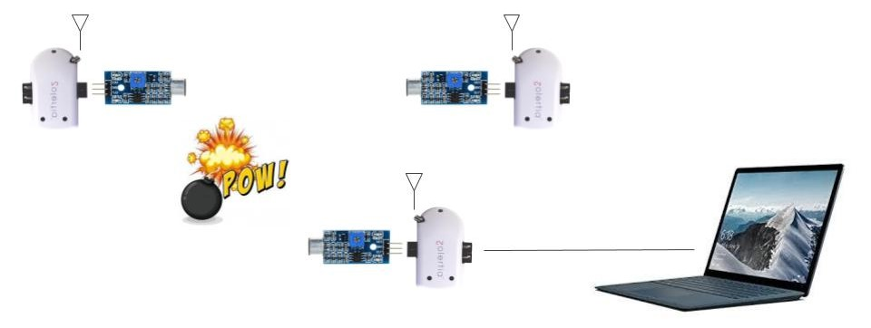

# MoteSync
Detección del epicentro de una fuente de sonido con red de sensores inalámbricos.




# Hola mundo

## Máquina nueva

Actualizar el GitHub:

```
cd /home/user/contiki
git config --global user.email federico.maximiliano.diaz@fing.edu.uy
git fetch origin
git pull origin master
```

Descargar ejemplos:

```
cd /home/user/contiki
git remote add iot-workshop https://github.com/alignan/contiki
git fetch iot-workshop
git checkout iot-workshop
```

Correr:

```
git submodule update --init
```

## Compilar ejemplos

```
cd contiki/examples/zolertia/tutorial/01-basics/
make TARGET=zoul savetarget
```

```
make 01-hello-world BOARD=remote-revb
sudo make 01-hello-world.upload MOTES=/dev/ttyUSB0
sudo make login MOTES=/dev/ttyUSB0
```

```
make 02-led-and-button BOARD=remote-revb 
sudo make 02-led-and-button.upload MOTES=/dev/ttyUSB0 NODEID=0x0014
sudo make login MOTES=/dev/ttyUSB0
```

## Cambiar la radio
En el project-conf poner:

```c
#undef  NETSTACK_CONF_RADIO
#define NETSTACK_CONF_RADIO         cc1200_driver
#define NETSTACK_CONF_RDC           nullrdc_driver
#define CC1200_CONF_USE_GPIO2       1
#define CC1200_CONF_USE_RX_WATCHDOG 0
#define ANTENNA_SW_SELECT_DEF_CONF  ANTENNA_SW_SELECT_SUBGHZ
#define RPL_MRHOF_CONF_MAX_LINK_METRIC 10000
```

[Zolertia Getting Started](https://github.com/Zolertia/Resources/wiki/Getting-Started-with-Zolertia-products)

# Pines


